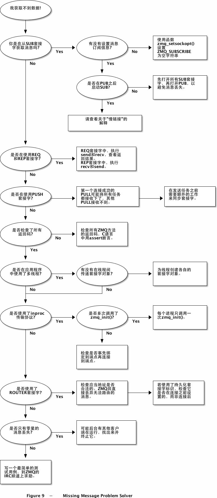

## 1. basic

### 1.1 提问-回答

### 正确地使用上下文

ZMQ应用程序的一开始总是会先创建一个上下文，并用它来创建套接字

一个进程中只应该创建一个上下文

上下文是一个容器，包含了该进程下所有的套接字，并为inproc协议提供实现，用以高速连接进程内不同的线程。

如果一个进程中创建了两个上下文，那就相当于启动了两个ZMQ实例。

如果你使用了fork()系统调用，那每个进程需要自己的上下文对象。如果在调用fork()之前调用了zmq_init()函数，那每个子进程都会有自己的上下文对象。

通常情况下，你会需要在子进程中做些有趣的事，而让父进程来管理它们。

### 正确地退出和清理

不要在多个线程中使用同一个套接字

关闭所有的套接字，并在主程序中关闭上下文对象。

如果仍有处于阻塞状态的recv或poll调用，应该在主程序中捕捉这些错误，并在相应的线程中关闭套接字。不要重复关闭上下文，zmq_term()函数会等待所有的套接字安全地关闭后才结束。

### 我们为什么需要ZMQ

目前的应用程序很多都会包含跨网络的组件，无论是局域网还是因特网。这些程序的开发者都会用到某种消息通信机制。有些人会使用某种消息队列产品，而大多数人则会自己手工来做这些事，使用TCP或UDP协议。这些协议使用起来并不困难，但是，简单地将消息从A发给B，和在任何情况下都能进行可靠的消息传输，这两种情况显然是不同的。

让我们看看在使用纯TCP协议进行消息传输时会遇到的一些典型问题。任何可复用的消息传输层肯定或多或少地会要解决以下问题：

1. 如何处理I/O？是让程序阻塞等待响应，还是在后台处理这些事？这是软件设计的关键因素。阻塞式的I/O操作会让程序架构难以扩展，而后台处理I/O也是比较困难的。

2. 如何处理那些临时的、来去自由的组件？我们是否要将组件分为客户端和服务端两种，并要求服务端永不消失？那如果我们想要将服务端相连怎么办？我们要每隔几秒就进行重连吗？

3. 我们如何表示一条消息？我们怎样通过拆分消息，让其变得易读易写，不用担心缓存溢出，既能高效地传输小消息，又能胜任视频等大型文件的传输？

4. 如何处理那些不能立刻发送出去的消息？比如我们需要等待一个网络组件重新连接的时候？我们是直接丢弃该条消息，还是将它存入数据库，或是内存中的一个队列？

5. 要在哪里保存消息队列？如果某个组件读取消息队列的速度很慢，造成消息的堆积怎么办？我们要采取什么样的策略？

6. 如何处理丢失的消息？我们是等待新的数据，请求重发，还是需要建立一套新的可靠性机制以保证消息不会丢失？如果这个机制自身崩溃了呢？

7. 如果我们想换一种网络连接协议，如用广播代替TCP单播？或者改用IPv6？我们是否需要重写所有的应用程序，或者将这种协议抽象到一个单独的层中？

8. 我们如何对消息进行路由？我们可以将消息同时发送给多个节点吗？是否能将应答消息返回给请求的发送方？

9. 我们如何为另一种语言写一个API？我们是否需要完全重写某项协议，还是重新打包一个类库？

10. 怎样才能做到在不同的架构之间传送消息？是否需要为消息规定一种编码？

11. 我们如何处理网络通信错误？等待并重试，还是直接忽略或取消？

### ZMQ的主要特点有：

1. ZMQ会在后台线程异步地处理I/O操作，它使用一种不会死锁的数据结构来存储消息。

2. 网络组件可以来去自如，ZMQ会负责自动重连，这就意味着你可以以任何顺序启动组件；用它创建的面向服务架构（SOA）中，服务端可以随意地加入或退出网络。

3. ZMQ会在有必要的情况下自动将消息放入队列中保存，一旦建立了连接就开始发送。

4. ZMQ有阈值（HWM）的机制，可以避免消息溢出。当队列已满，ZMQ会自动阻塞发送者，或丢弃部分消息，这些行为取决于你所使用的消息模式。

5. ZMQ可以让你用不同的通信协议进行连接，如TCP、广播、进程内、进程间。改变通信协议时你不需要去修改代码。

6. ZMQ会恰当地处理速度较慢的节点，会根据消息模式使用不同的策略。

7. ZMQ提供了多种模式进行消息路由，如请求-应答模式、发布-订阅模式等。这些模式可以用来搭建网络拓扑结构。

8. ZMQ中可以根据消息模式建立起一些中间装置（很小巧），可以用来降低网络的复杂程度。

9. ZMQ会发送整个消息，使用消息帧的机制来传递。如果你发送了10KB大小的消息，你就会收到10KB大小的消息。

10. ZMQ不强制使用某种消息格式，消息可以是0字节的，或是大到GB级的数据。当你表示这些消息时，可以选用诸如谷歌的protocol buffers，XDR等序列化产品。

11. ZMQ能够智能地处理网络错误，有时它会进行重试，有时会告知你某项操作发生了错误。

12. ZMQ甚至可以降低对环境的污染，因为节省了CPU时间意味着节省了电能。

### 如果解决丢失消息的问题

## ZeroMQ进阶

- 创建和使用ZMQ套接字
- 使用套接字发送和接收消息
- 使用ZMQ提供的异步I/O套接字构建你的应用程序
- 在单一线程中使用多个套接字
- 恰当地处理致命和非致命错误
- 处理诸如Ctrl-C的中断信号
- 正确地关闭ZMQ应用程序
- 检查ZMQ应用程序的内存泄露
- 发送和接收多帧消息
- 在网络中转发消息
- 建立简单的消息队列代理
- 使用ZMQ编写多线程应用程序
- 使用ZMQ在线程间传递信号
- 使用ZMQ协调网络中的节点
- 使用标识创建持久化套接字
- 在发布-订阅模式中创建和使用消息信封
- 如何让持久化的订阅者能够从崩溃中恢复
- 使用阈值（HWM）防止内存溢出

### 套接字API

- 创建和销毁套接字：zmq_socket(), zmq_close()
- 配置和读取套接字选项：zmq_setsockopt(), zmq_getsockopt()
- 为套接字建立连接：zmq_bind(), zmq_connect()
- 发送和接收消息：zmq_send(), zmq_recv()

在ZMQ中所有的套接字都是由ZMQ管理的，只有消息是由程序员管理的。

## 高级请求-应答模式

- 在请求-应答模式中创建和使用消息信封
- 使用REQ、REP、DEALER和ROUTER套接字
- 使用标识来手工指定应答目标
- 使用自定义离散路由模式
- 使用自定义最近最少使用路由模式
- 构建高层消息封装类
- 构建基本的请求应答代理
- 合理命名套接字
- 模拟client-worker集群
- 构建可扩展的请求-应答集群云
- 使用管道套接字监控线程

## 可靠的请求-应答模式

- 客户端请求-应答
- 最近最少使用队列
- 心跳机制
- 面向服务的队列
- 基于磁盘（脱机）队列
- 主从备份服务
- 无中间件的请求-应答

### 什么是可靠性？

- 应用程序代码是最大的故障来源。程序会崩溃或中止，停止对数据来源的响应，或是响应得太慢，耗尽内存等。
- 系统代码，如使用ZMQ编写的中间件，也会意外中止。系统代码应该要比应用程序代码更为可靠，但毕竟也有可能崩溃。特别是当系统代码与速度过慢的客户端交互时，很容易耗尽内存。
- 消息队列溢出，典型的情况是系统代码中没有对蛮客户端做积极的处理，任由消息队列溢出。
- 网络临时中断，造成消息丢失。这类错误ZMQ应用程序是无法及时发现的，因为ZMQ会自动进行重连。
- 硬件系统崩溃，导致所有进程中止。
- 网络会出现特殊情形的中断，如交换机的某个端口发生故障，导致部分网络无法访问。
- 数据中心可能遭受雷击、地震、火灾、电压过载、冷却系统失效等。

### 可靠性设计

请求-应答模式：当服务端在处理请求是中断，客户端能够得知这一信息，并停止接收消息，转而选择等待重试、请求另一服务端等操作。这里我们暂不讨论客户端发生问题的情形。

发布-订阅模式：如果客户端收到一些消息后意外中止，服务端是不知道这一情况的。发布-订阅模式中的订阅者不会返回任何消息给发布者。但是，订阅者可以通过其他方式联系服务端，如请求-应答模式，要求服务端重发消息。这里我们暂不讨论服务端发生问题的情形。此外，订阅者可以通过某些方式检查自身是否运行得过慢，并采取相应措施（向操作者发出警告、中止等）。

管道模式：如果worker意外终止，任务分发器将无从得知。管道模式和发布-订阅模式类似，只朝一个方向发送消息。但是，下游的结果收集器可以检测哪项任务没有完成，并告诉任务分发器重新分配该任务。如果任务分发器或结果收集器意外中止了，那客户端发出的请求只能另作处理。所以说，系统代码真的要减少出错的几率，因为这很难处理。

#### 请求-应答可靠性设计

最基本的请求应答模式是REQ客户端发送一个同步的请求至REP服务端，这种模式的可靠性很低。如果服务端在处理请求时中止，那客户端会永远处于等待状态。

相比TCP协议，ZMQ提供了自动重连机制、消息分发的负载均衡等。但是，在真实环境中这也是不够的。唯一可以完全信任基本请求-应答模式的应用场景是同一进程的两个线程之间进行通信，没有网络问题或服务器失效的情况。

只要稍加修饰，这种基本的请求-应答模式就能很好地在现实环境中工作了。我喜欢将其称为“海盗”模式。

1. 多个客户端直接和单个服务端进行通信。使用场景：只有一个单点服务器，所有客户端都需要和它通信。需处理的故障：服务器崩溃和重启；网络连接中断。

2. 多个客户端和单个队列装置通信，该装置将请求分发给多个服务端。使用场景：任务分发。需处理的故障：worker崩溃和重启，死循环，过载；队列装置崩溃和重启；网络中断。

3. 多个客户端直接和多个服务端通信，无中间件。使用场景：类似域名解析的分布式服务。需处理的故障：服务端崩溃和重启，死循环，过载；网络连接中断。

## ref

https://wizardforcel.gitbooks.io/zmq-guide/content/chapter1.html

